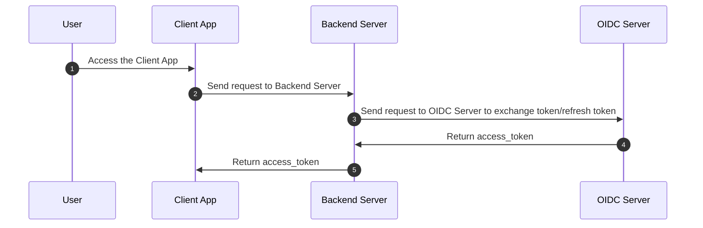

# SKY MAVIS SSO QUICK START


## Structure 



<br/>

```
├── README.md
├── client (Client App)
│   ├── oidc-browser-extension-authorization-code
│   ├── oidc-electron-authorization-code
│   ├── oidc-javascript-authorization-code
│   ├── oidc-nextjs-authorization-code
│   ├── oidc-nextjs-authorization-code-get-user-info
│   ├── oidc-nextjs-authorization-code-pkce
│   ├── oidc-nextjs-authorization-code-refresh-token
│   ├── oidc-nextjs-implicit
│   ├── oidc-nextjs-ropc
│   ├── oidc-nextjs-ropc-ronin-extension
│   ├── oidc-nextjs-ropc-ronin-qrcode
│   └── oidc-unity-authorization-code
└── server (Backend Server)
    └── nodejs
```


## Prerequisites

#### 1. Setup Nodejs and pnpm:
   - Nodejs >= 16.17.0
   - pnpm >= 7.5.2
<br/>
#### 2. Request access to Sky Mavis Account and configure client settings.
   - Docs: <https://docs.skymavis.com/docs/sma-get-started>
   - Developer Portal: <https://developers.skymavis.com/>
<br/>
#### 3. When you have access to the Sky Mavis Account service, open the Developer Console > Products > OAuth 2.0 to configure the client-side settings.

   - CLIENT ID
   - CLIENT SECRET
   - SIGN IN REDIRECT URI (OIDC_CALLBACK_URL)


#### 4. All environments variables can be used in this repository.

```shell
# APP KEY
API_KEY=<your_api_key>

# OIDC ENV
OIDC_CLIENT_ID=<your_client_id>
OIDC_CLIENT_SECRET=<your_client_secret>
OIDC_SCOPE="openid offline"
OIDC_CALLBACK_URL=http://localhost:3000/oauth2/callback

# OIDC ENDPOINTS
OIDC_AUTHORIZATION_ENDPOINT=https://api-gateway.skymavis.com/oauth2/auth
OIDC_TOKEN_ENDPOINT=https://api-gateway.skymavis.com/account/oauth2/token
OIDC_USERINFO_ENDPOINT=https://api-gateway.skymavis.com/account/userinfo
OIDC_JWKS_ENDPOINT=https://api-gateway.skymavis.com/account/.well-known/jwks.json

# SERVER ENDPOINTS: YOUR SERVER APIs
SERVER_TOKEN_ENDPOINT=http://localhost:8080/oauth2/authorization-code/token
SERVER_REFRESH_TOKEN_ENDPOINT=http://localhost:8080/oauth2/authorization-code/refresh_token
SERVER_ROPC_TOKEN_ENDPOINT=http://localhost:8080/oauth2/ropc/token
SERVER_ROPC_MFA_ENDPOINT=http://localhost:8080/oauth2/ropc/mfa
SERVER_USERINFO_ENDPOINT=http://localhost:8080/oauth2/userinfo
SERVER_RONIN_NONCE_ENDPOINT=http://localhost:8080/oauth2/ronin/fetch-nonce
SERVER_RONIN_TOKEN_ENDPOINT=http://localhost:8080/oauth2/ronin/token

# ELECTRON ENV
CALLBACK_DEEPLINK=mavis-electron-app://oauth2/callback

# CAPTCHA ENV
GEETEST_ENDPOINT=https://captcha.skymavis.com/api/geetest/register
```

## How to run

#### 1. Go to your favorite sample

#### 2. Setup ```.env``` same as ```.env.example``` in your favorite sample

#### 3. Run Nodejs server:

```shell
cd server/nodejs
pnpm install && pnpm dev
```

#### 4. Go to your client favorite sample, install packages and start:

```shell
cd client/oidc-nextjs-ropc
pnpm install && pnpm dev
```
