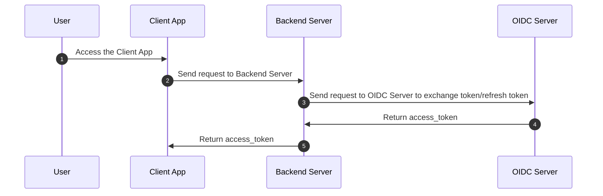

# Sky Mavis OAuth 2.0 quickstart

This guide demonstrates how to quickly integrate Sky Mavis Account sign-in into an app. The integration allows users to do the following:

- Sign in to the app with their Sky Mavis account.
- Access protected resources in the app.

The repository contains sample client apps in various languages and frameworks, such as JavaScript vanilla, Next.js, browser extension, Electron, and Unity.

This quickstart covers the following topics:

1. Folder structure and sequence diagram of the integration
2. Prerequisites for setting up the integration
3. Environment variables used in the repository
4. Instructions on how to run the integration

## Folder structure

```
├── README.md
├── client (client app)
│   ├── oidc-browser-extension-authorization-code
│   ├── oidc-electron-authorization-code
│   ├── oidc-javascript-authorization-code
│   ├── oidc-nextjs-authorization-code
│   ├── oidc-nextjs-authorization-code-get-user-info
│   ├── oidc-nextjs-authorization-code-pkce
│   ├── oidc-nextjs-authorization-code-refresh-token
│   ├── oidc-nextjs-implicit
│   ├── oidc-nextjs-ropc
│   ├── oidc-nextjs-ropc-ronin-extension
│   ├── oidc-nextjs-ropc-ronin-qrcode
│   └── oidc-unity-authorization-code
└── server (backend server)
    └── nodejs
```

## Integration flow



## Prerequisites

- Node.js version 16.17.0 or later. Install using a [package manager](https://nodejs.dev/en/download/package-manager) or download the [official installer](https://nodejs.dev/en/).
- pnpm version 7.5.2 or later. Install following the [official instruction](https://pnpm.io/installation).
- API key, access to the Sky Mavis Account service, and fully configured OAuth 2.0 settings. For more information, see [Get started](https://docs.skymavis.com/docs/mavis-services/mavis-account/guides/get-started).

## Environment variables

The following environment variables can be used in this repository:

```shell
# APP KEY
API_KEY=<your_api_key>

# OIDC ENV
OIDC_CLIENT_ID=<your_client_id>
OIDC_CLIENT_SECRET=<your_client_secret>
OIDC_SCOPE="openid offline"
OIDC_CALLBACK_URL=http://localhost:3000/oauth2/callback

# OIDC ENDPOINTS
OIDC_AUTHORIZATION_ENDPOINT=https://api-gateway.skymavis.com/oauth2/auth
OIDC_TOKEN_ENDPOINT=https://api-gateway.skymavis.com/account/oauth2/token
OIDC_USERINFO_ENDPOINT=https://api-gateway.skymavis.com/account/userinfo
OIDC_JWKS_ENDPOINT=https://api-gateway.skymavis.com/account/.well-known/jwks.json

# SERVER ENDPOINTS: YOUR SERVER APIs
SERVER_TOKEN_ENDPOINT=http://localhost:8080/oauth2/authorization-code/token
SERVER_REFRESH_TOKEN_ENDPOINT=http://localhost:8080/oauth2/authorization-code/refresh_token
SERVER_ROPC_TOKEN_ENDPOINT=http://localhost:8080/oauth2/ropc/token
SERVER_ROPC_MFA_ENDPOINT=http://localhost:8080/oauth2/ropc/mfa
SERVER_USERINFO_ENDPOINT=http://localhost:8080/oauth2/userinfo
SERVER_RONIN_NONCE_ENDPOINT=http://localhost:8080/oauth2/ronin/fetch-nonce
SERVER_RONIN_TOKEN_ENDPOINT=http://localhost:8080/oauth2/ronin/token

# ELECTRON ENV
CALLBACK_DEEPLINK=mavis-electron-app://oauth2/callback

# CAPTCHA ENV
GEETEST_ENDPOINT=https://captcha.skymavis.com/api/geetest/register
```

## Integrate Sky Mavis Account sign-in

### Step 1. Choose a sample app

Choose the app of your interest from the `./client` folder.

### Step 2. Set up environment variables

Set up the `.env` file according to the provided `.env.example` file in your selected sample app.

### 3. Run the Node.js server

Navigate to the `./server/nodejs` folder and execute the following commands:

```shell
cd server/nodejs
pnpm install && pnpm dev
```

### 4. Start the client app

Navigate to your chosen client sample in the `./client` folder, install the required packages, and start the application:

```shell
cd client/oidc-nextjs-ropc
pnpm install && pnpm dev
