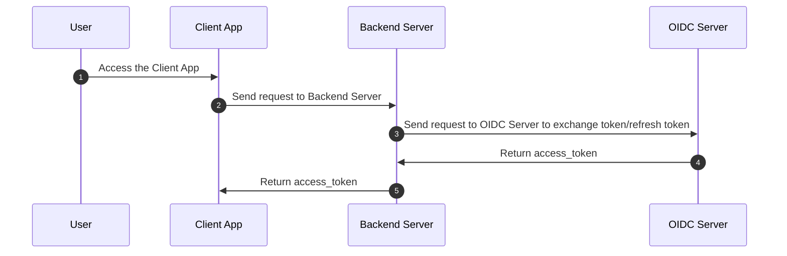

# SKY MAVIS SSO QUICK START

This guide provides quick start instructions for setting up and running the SKY MAVIS Single Sign-On (SSO) integration. The integration allows users to authenticate with their Sky Mavis account and access protected resources in your application.

The samples provided cover various languages and frameworks such as JavaScript vanilla, Next.js, Browser extension, Electron, Unity, and more.

The guide covers the following topics:

1. Folder structure and sequence diagram of the integration
2. Prerequisites for setting up the integration
3. Configuration steps for requesting access to Sky Mavis Account and setting up client-side settings
4. Environment variables used in the repository
Instructions on how to run the integration

## Folder Structure

```
├── README.md
├── client (Client App)
│   ├── oidc-browser-extension-authorization-code
│   ├── oidc-electron-authorization-code
│   ├── oidc-javascript-authorization-code
│   ├── oidc-nextjs-authorization-code
│   ├── oidc-nextjs-authorization-code-get-user-info
│   ├── oidc-nextjs-authorization-code-pkce
│   ├── oidc-nextjs-authorization-code-refresh-token
│   ├── oidc-nextjs-implicit
│   ├── oidc-nextjs-ropc
│   ├── oidc-nextjs-ropc-ronin-extension
│   ├── oidc-nextjs-ropc-ronin-qrcode
│   └── oidc-unity-authorization-code
└── server (Backend Server)
    └── nodejs
```

## Sequence Diagram



## Prerequisites

### 1. Setup Nodejs and pnpm

- Ensure that you have `Node.js` installed with a version >= 16.17.0.
- Install the `pnpm` package manager with a version >= 7.5.2.

### 2. Request access to Sky Mavis Account and configure client settings

- To get started, request access to the Sky Mavis Account service.
- Follow the documentation provided in the [Sky Mavis Documentation](https://docs.skymavis.com/docs/sma-get-started) to configure your client settings.

### 3. Configure Client-side Settings in Sky Mavis Account Service

- Once you have access to the Sky Mavis Account service, navigate to the Developer Console > Products > OAuth 2.0 section. You will get some variables below:
  - **CLIENT ID**: Obtain a unique client ID for your application.
  - **CLIENT SECRET**: Generate a client secret key.
  - **SIGN IN REDIRECT URI (OIDC_CALLBACK_URL)**: Define the redirect URI where the user will be redirected after signing in.


### 4. Environment Variables

The following environment variables can be used in this repository:

```shell
# APP KEY
API_KEY=<your_api_key>

# OIDC ENV
OIDC_CLIENT_ID=<your_client_id>
OIDC_CLIENT_SECRET=<your_client_secret>
OIDC_SCOPE="openid offline"
OIDC_CALLBACK_URL=http://localhost:3000/oauth2/callback

# OIDC ENDPOINTS
OIDC_AUTHORIZATION_ENDPOINT=https://api-gateway.skymavis.com/oauth2/auth
OIDC_TOKEN_ENDPOINT=https://api-gateway.skymavis.com/account/oauth2/token
OIDC_USERINFO_ENDPOINT=https://api-gateway.skymavis.com/account/userinfo
OIDC_JWKS_ENDPOINT=https://api-gateway.skymavis.com/account/.well-known/jwks.json

# SERVER ENDPOINTS: YOUR SERVER APIs
SERVER_TOKEN_ENDPOINT=http://localhost:8080/oauth2/authorization-code/token
SERVER_REFRESH_TOKEN_ENDPOINT=http://localhost:8080/oauth2/authorization-code/refresh_token
SERVER_ROPC_TOKEN_ENDPOINT=http://localhost:8080/oauth2/ropc/token
SERVER_ROPC_MFA_ENDPOINT=http://localhost:8080/oauth2/ropc/mfa
SERVER_USERINFO_ENDPOINT=http://localhost:8080/oauth2/userinfo
SERVER_RONIN_NONCE_ENDPOINT=http://localhost:8080/oauth2/ronin/fetch-nonce
SERVER_RONIN_TOKEN_ENDPOINT=http://localhost:8080/oauth2/ronin/token

# ELECTRON ENV
CALLBACK_DEEPLINK=mavis-electron-app://oauth2/callback

# CAPTCHA ENV
GEETEST_ENDPOINT=https://captcha.skymavis.com/api/geetest/register
```

## How to run

### 1. Choose a Sample

Go to your favorite sample from the `./client` folder.

### 2. Setup Environment Variables

Set up the `.env` file according to the provided `.env.example` file in your selected sample.

### 3. Run the Nodejs server

Navigate to the `./server/nodejs` folder and execute the following commands:

```shell
cd server/nodejs
pnpm install && pnpm dev
```

### 4. Start the Client App

Navigate to your chosen client sample in the `./client` folder, install the required packages, and start the application:

```shell
cd client/oidc-nextjs-ropc
pnpm install && pnpm dev
